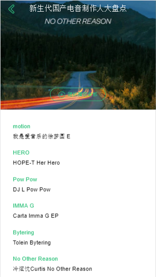
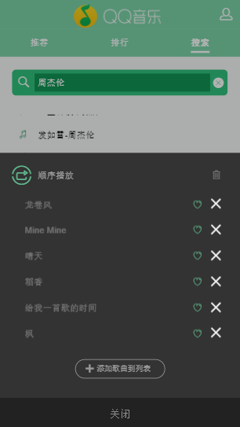
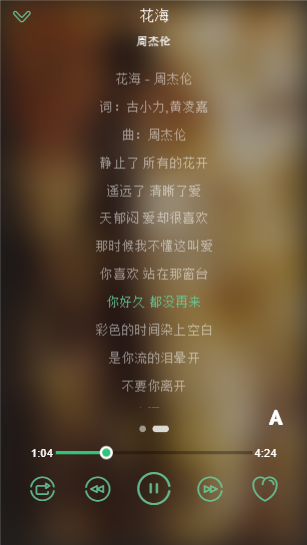
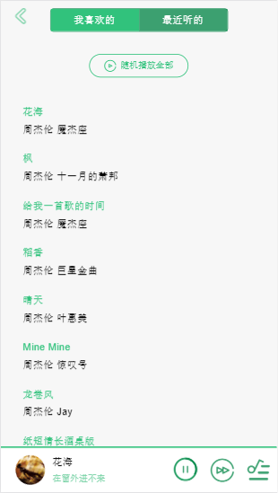

# 移动端QQ音乐

## 主要技术栈
 - Vue
 - Vuex 
    - 组件间数据共享
 - Vue-router 
    - 前端路由跳转
    - 路由懒加载
 - axios
   - 异步数据请求
## 功能
- [x] 排行榜单
- [x] 歌单推荐
- [x] 歌曲搜索
  - 记录搜索历史
  - 清除搜索历史
- [x] 播放器内核 
  - 随机播放
  - 顺序播放
  - 单曲循环
  - 歌词同步
- [x] 收藏喜欢歌曲
- [x] 记录最近播放
# 项目收获
- 熟悉Vue全家桶开发流程
- 移动端CSS适配
- 组件逻辑复用
- 分治的思想,将复杂问题拆分解决,再集合使用.
# 项目总结
- 做复杂项目时项目文件结构一定要清晰,对于日后维护有极大帮助,业务相关逻辑放入components目录内,UI相关组件放入base文件夹内.对于组件内通用的函数应该独立编写一个工具库,在使用时引入减少重复代码.
- 复用组件需要足够的抽象,不应该涉及相关业务逻辑,内部只提供相关接口,数据由引用它的组件决定.
- 第一次使用Vue全家桶进行开发,引入Vuex对于管理多组件间共享的复杂数据带来极大方便.使得项目结构更加清晰,尤其是对于Vue数据驱动视图的MVVM框架来说,有极大帮助.

# 效果预览

